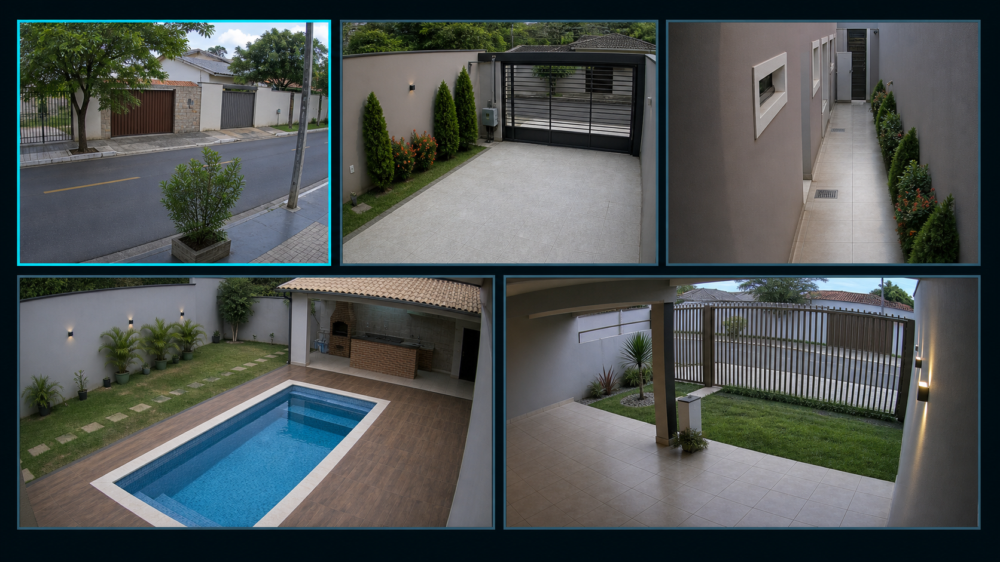

# Sentinela Cam TV

Sentinela Cam TV é um aplicativo open-source para visualizar câmeras de segurança em Android TV e Google TV.

Ele foi criado para monitoramento local, com foco em privacidade, simplicidade e bom funcionamento em TVs e TV Boxes com hardware modesto.

## Principais recursos

- Visualização em mosaico.
- Tela cheia para cada câmera.
- Cadastro por RTSP direto.
- Descoberta e cadastro por ONVIF.
- Atualização manual pelo GitHub Releases.
- Logs locais para suporte.
- Interface pensada para controle remoto.

## Privacidade

O Sentinela Cam TV não usa anúncios, rastreamento, analytics, telemetria, Firebase, Google Play Services ou nuvem obrigatória.

As câmeras são acessadas localmente. O aplicativo não envia imagens, credenciais ou dados das câmeras para servidores externos.

## Download

Baixe a versão mais recente na página de releases:

https://github.com/d3funto/SentinelaCamTV/releases/latest

## Estado do projeto

O app está em desenvolvimento ativo. Algumas funções ainda podem mudar, e testes em diferentes modelos de TV Box são importantes.

No momento, o projeto está em desenvolvimento individual. Relatos de bugs são bem-vindos pelas Issues, mas contribuições de código ainda não estão abertas.

## Licença

Sentinela Cam TV é software livre licenciado sob `GPL-3.0-or-later`.
